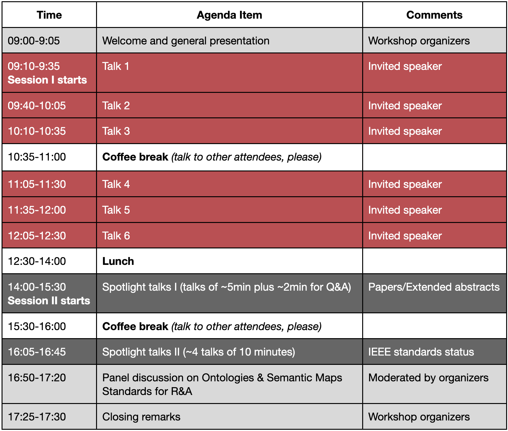

**Location:** Room Schubert 6, Vienna Congress & Convention Center in Vienna, Austria [(info)](https://vieconcenter.at/en/schubert) 

**Invited speakers for Session I**

- **[Talk 1] Karinne Ramírez-Amaro**, Chalmers University of Technology, Sweden  
*Transparent Robot Decision-Making with Interpretable & Explainable Methods*

- **[Talk 2] Minsu Jang**, Electronics and Telecommunications Research Institute, South Korea
*Knowledge engineering for robots in the era of foundation models*

- **[Talk 3] Seung-Min Baek**, LG Electronics, South Korea
*Embodied AI for Humanoid Robots in Personalized Household Environments*

- **[Talk 4] Chung Hyuk Park**, George Washington University, USA
*Contextual Human Robot Interaction and Situational Awareness*

- **[Talk 5] Joanna Olszewska**, University of the West of Scotland, 
*Formalising Trustworthiness of Autonomous Systems*

- **[Talk 6] Lorenzo Ferrini**, PAL Robotics
*Querying the World: Bridging Physical and Symbolic Information for Interactive Robots*

 

**Tentative agenda**

Note that time is in the local time zone (CEST). 

 

<!--

**Panelists**

- **Dr. Joanna Olszewska** (University of the West of Scotland)

- **Prof. Jaeho Lee** (University of Seoul)

- **Prof. Tae-Yong Kuc** (Sung Kyun Kwan University)

- **Dr. DongKi Noh** (LG Electronics Inc)
-->

